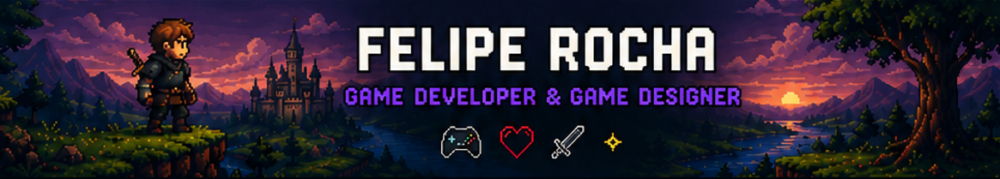
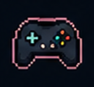
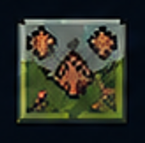
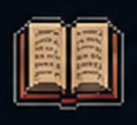
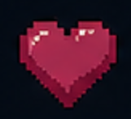

# ❤️ Hi, I'm Felipe! 🎮

### Apaixonado por criar mundos, sistemas e experiências que conectam jogadores.

Transformo ideias em jogos com gameplay envolvente, desafios e propósito.

---

# 🛠️ Ferramentas e Tecnologias

<table>
<tr>

<td align="center" width="33%">

## 🎨 Design & Documentação

</td>

<td align="center" width="33%">

## 🎮 Engines

</td>

<td align="center" width="33%">

## ⚡ Outros

</td>

</tr>
</table>

---

# 🎮 O que eu faço

<table>
<tr>

<td align="center" width="25%">

## 🎮 Game Design

Systems, Mechanics, Economy, Balance & Progression

</td>

<td align="center" width="25%">

## 🗺️ Level Design

Layouts, Fluxo, Desafios e Narrativa Ambiental

</td>

<td align="center" width="25%">

## 📖 Narrative Design

História, Worldbuilding e Diálogos

</td>

<td align="center" width="25%">

## ❤️ Player Experience

Diversão, Feedback, Curva de Aprendizado & Engajamento

</td>

</tr>
</table>

---

# 🕹️ Projetos em Destaque

<table>
<tr>

<td width="30%">

</td>

<td>

# 🐧 Guim: A Jornada do Guardião

Aventura 3D em mundo aberto inspirada em Zelda e Genshin Impact.

### Features:
- ⚔️ Combate em tempo real
- 🌎 Mundo aberto estilizado
- 👹 Bosses temáticos
- 🧩 Biomas únicos
- 🎮 Coop online

`Unity` `C#` `3D` `RPG`

</td>

</tr>
</table>

---

<table>
<tr>

<td width="30%">

</td>

<td>

# ⚔️ RPG Open World Prototype

Protótipo de RPG focado em exploração, combate e progressão.

### Sistemas:
- Sistema de stamina
- IA de inimigos
- Inventário
- Loot & Crafting
- Quest System

`Unity` `C#` `AI` `Systems`

</td>

</tr>
</table>

---

<table>
<tr>

<td width="30%">

</td>

<td>

# ❄️ Dungeon Seeds

Roguelite top-down com sementes procedurais e builds únicas.

### Features:
- ⚔️ Combate desafiador
- 🧩 Itens & Relíquias
- 🔥 Progressão por runs
- 👾 Inimigos variados

`Unity` `Roguelite` `2D`

</td>

</tr>
</table>

---

# 📚 Atualmente

- 🎮 Estudando Unity avançado e C#
- ⚡ Aprimorando gameplay systems
- 🤖 Estudando IA para inimigos
- 🌎 Melhorando meu inglês para trabalhar internacionalmente
- 🛠️ Desenvolvendo protótipos e sistemas RPG

---

# 🚀 Vamos criar algo incrível?

Aberto a:
- 🎮 Projetos indie
- 🤝 Colaborações
- ⚔️ Game jams
- 💼 Oportunidades em Game Development

---

# 📊 GitHub Stats

---

# 🌎 Onde me encontrar

---

## ⚡ “Games são experiências que ficam marcadas nas pessoas.”

